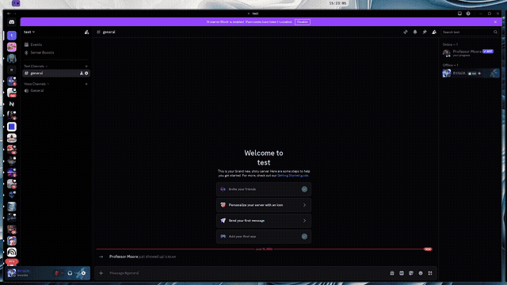

# Professor Moore

A premium Discord study bot with a dark academia aesthetic. Professor Moore monitors study voice channels, tracks session times, runs automatic Pomodoro cycles, and generates beautiful image-based leaderboards, profile cards, and session summaries.



## Features

- **Automatic Tracking** — Join a study VC and your time is tracked. Leave and get a session summary card.
- **Pomodoro Timer** — 50-minute focus / 10-minute break cycles start automatically when the first person joins. A live timer image updates every minute.
- **Leaderboards** — Image-based rankings with podium, avatars, and study times. Filter by daily, weekly, monthly, or all-time.
- **Profile Cards** — Personal stats card with total time, sessions, best session, rank, streak, and a random literature quote.
- **Session Summaries** — On leave, get a summary image with your session duration, today's total, session count, and streak.
- **Study Streaks** — Consecutive day tracking displayed across profile cards and session summaries.
- **Studying Role** — Automatically assigned when joining the study VC, removed when leaving.
- **Real-Time Stats** — All times update live, including active sessions that haven't ended yet.
- **Multi-Server** — Each server configures its own study VC and role via `/setup`.
- **Both `!` and `/` commands** — Full support for prefix and slash commands.

## Commands

| Command | Description |
|---------|-------------|
| `/setup #channel [role]` | Configure the study VC and role (admin only) |
| `/leaderboard [period]` | Study time rankings (all, daily, weekly, monthly) |
| `/studytime [period]` | Your personal study time |
| `/profile [@user]` | Student profile card |
| `/pomodoro` | Current focus timer status |
| `/history [@user]` | Recent session history |
| `/help` | All commands and how the bot works |

All slash commands also work as prefix commands with `!`.

## Setup

### Prerequisites

- Python 3.11+
- Roboto font family installed (`Roboto-Bold`, `Roboto-Medium`, `Roboto-Regular`, `Roboto-Light`, `Roboto-Black`, `RobotoCondensed-Bold`)
- Liberation Serif font installed

### Installation

```bash
git clone https://github.com/your-username/professor-moore.git
cd professor-moore
pip install -r requirements.txt
```

### Configuration

Create a `config.py` file:

```python
BOT_TOKEN = "your-bot-token-here"

POMODORO_WORK = 50    # minutes
POMODORO_BREAK = 10   # minutes

DB_PATH = "study_data.db"
```

### Running

```bash
python bot.py
```

### Discord Setup

1. Create a bot at the [Discord Developer Portal](https://discord.com/developers/applications)
2. Enable **Privileged Gateway Intents**: Server Members, Message Content, Presence
3. Under **Installation**, set the install link to Discord Provided Link with scopes `bot` and `applications.commands`
4. Add bot permissions: Manage Roles, Send Messages, Attach Files, Connect, View Channels
5. Invite the bot to your server
6. Run `/setup #your-study-vc` in your server

## Project Structure

```
bot.py              — Main bot logic, commands, and event handlers
config.py           — Bot token and pomodoro settings
database.py         — SQLite database with per-guild session tracking
leaderboard.py      — PIL image generation for leaderboard rankings
timer_image.py      — PIL image generation for focus/break timer
profile_card.py     — PIL image generation for student profile cards
session_summary.py  — PIL image generation for session leave summaries
quotes.py           — Literature and philosophy quote collection
requirements.txt    — Python dependencies
```

## Tech Stack

- **discord.py 2.7+** with Components V2 and slash commands
- **Pillow** for all image generation
- **SQLite** with WAL journal mode
- **aiohttp** for fetching Discord avatars

## Credits

Created by **Ryuga**.

*"That voice in your head that says you can't do it is a liar."* — Prof. Moore
